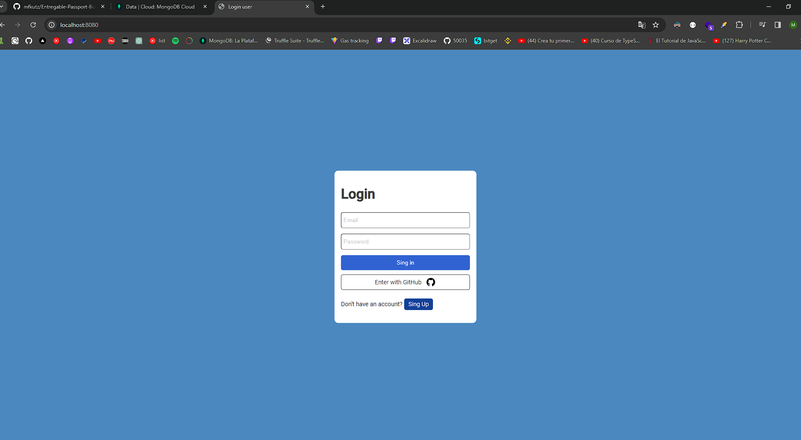
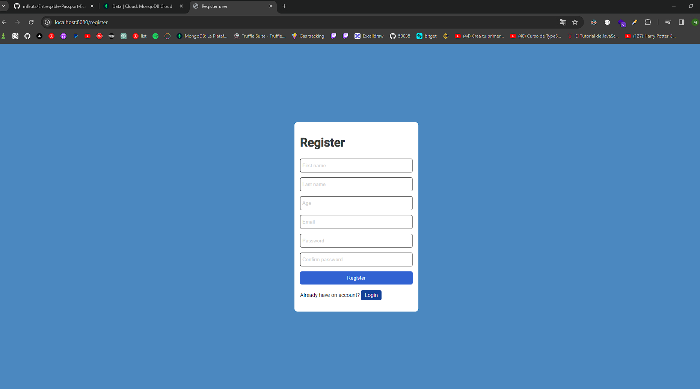
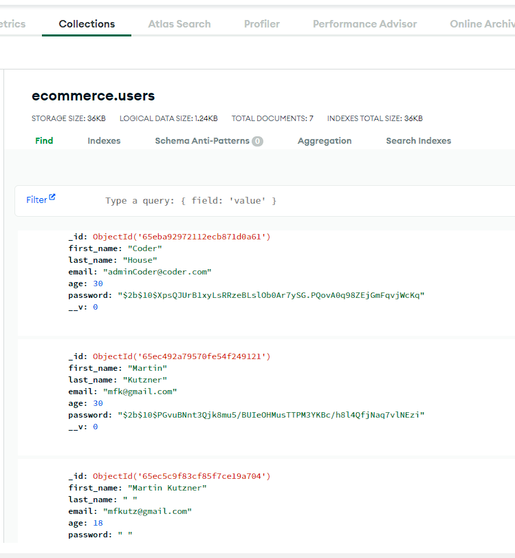

Refactor a nuestro Login

    - Al cargar el proyecto, éste deberá comenzar en la pantalla de login ✅

      http://localhost:8080/
      

    - Al no tener un usuario registrado aún, se procederá a hacer un registro,
      por lo que la pantalla de login debe tener un link de “regístrate”,
      el cual nos redireccione a la pantalla de registro.✅

      http://localhost:8080/register
      

    - Al registrarme con los datos solicitados, se revisará la contraseña guardada
      en la base de datos, cuidando que ésta esté correctamente hasheada.✅

      

    - Se realizará el proceso de login con las mismas credenciales con las que se
      registró el usuario, corroborando que el login funcione correctamente y
      redirija a la pantalla principal.✅

    - Además, la pantalla de login deberá contar con un botón “entrar con Github”
      el cual al hacer click nos permita entrar directamente a la página
      con los datos obtenidos de Github.✅

    - Se corroborará en la base de datos que el nuevo usuario “creado
      con Github” cuente con un password vacío.✅
